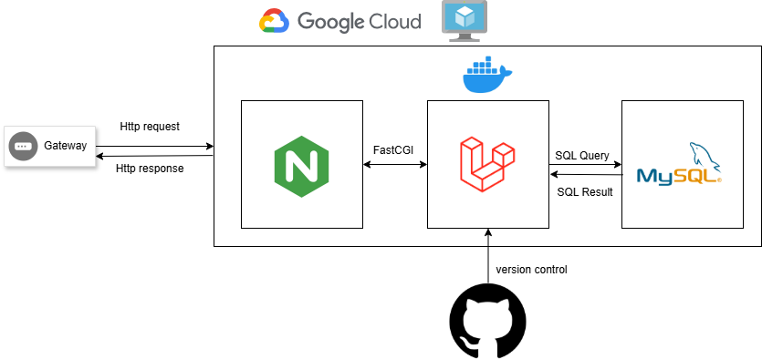
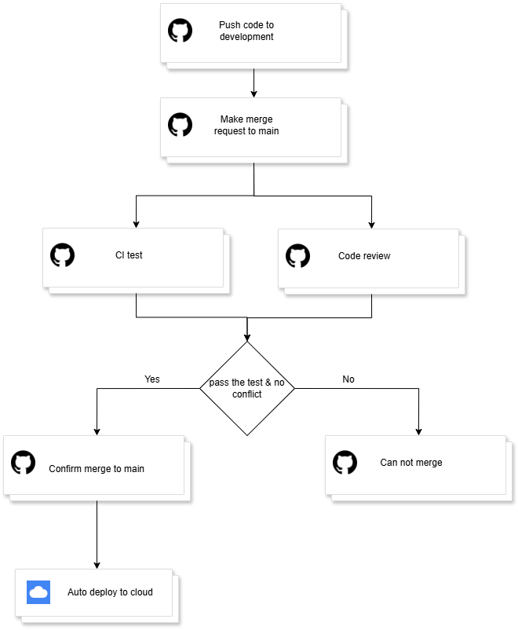

# About this project

This is the part of Microservice project in DevOps theory class that my team has working on Stock Management System and we have 3 service such as 
- Product Service
- Inventory (Stock) Service
- Order Service

Along with one api gate way that connect all of that product together

# About this repository

This repository is part of one of our service call product service where it has feature such as 

- Manages product information
- CRUD products (Admin)
- stores product data (name, price, category...)

# About technology and achitecture

This project implements a Product Service using a modern, containerized backend architecture designed for reliability, scalability, and maintainability.

## Architecture Overview

The system follows a layered architecture:

- Gateway / Client sends HTTP requests to the backend service
- Nginx acts as a reverse proxy and web server, handling incoming HTTP traffic and forwarding requests
- Laravel API implements business logic and RESTful endpoints for product management
- MySQL stores structured product data such as name, SKU, price, and stock
- All services are containerized using Docker and deployed on Google Cloud infrastructure

This separation of concerns ensures clear responsibility for each component and allows the service to scale independently.

## Technology Stack

- Laravel: Used as the backend framework to build a clean and secure REST API with built-in validation, ORM (Eloquent), and MVC architecture.
- MySQL: A relational database chosen for its strong data consistency and suitability for structured product data.
- Nginx: Acts as a reverse proxy in front of Laravel, improving performance, handling concurrent requests, and serving static content efficiently.
- Docker: Ensures consistent runtime environments across development and production, simplifies deployment, and supports a microservice-ready setup.
- Google Cloud: Provides reliable cloud infrastructure for hosting containers, networking, and scalability in production.

# About CI/CD Pipe line

To working on CI/CD pipe line this project has make 2 branch call main and development. The main branch is the brach where it will trigger the deploy (CD) to the server and Development branch is the where it handle the code check (CI) and we have 5 step in it such as:
- Step 1: Push the code to development branch
- Step 2: Make the merge request to the main branch
- Step3 and Step 4: While make the merge request the CI will auto check and the code reviewer need to review the code that make sure no conflic
- Step 5: If the pass the check user will confirm the merge and it will auto deploy to cloud but if it now pass the test it will not auto deploy